# TAREA 1: Crear un servidor para dar respuesta a las necesidades de la aplicación a desarrollar.

#### 1. Instalar Ubuntu Server 18.04 y crear las claves SSH para conectarse al servidor.

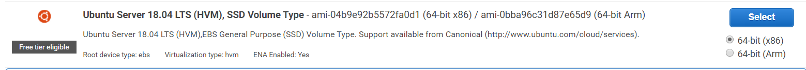
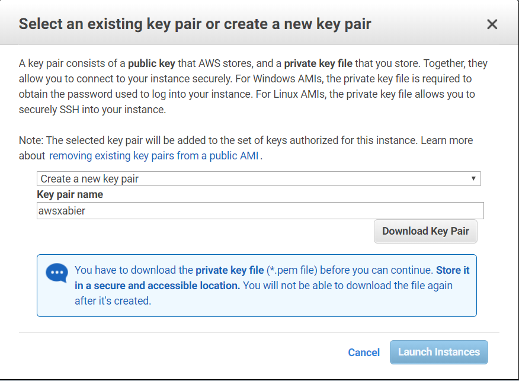
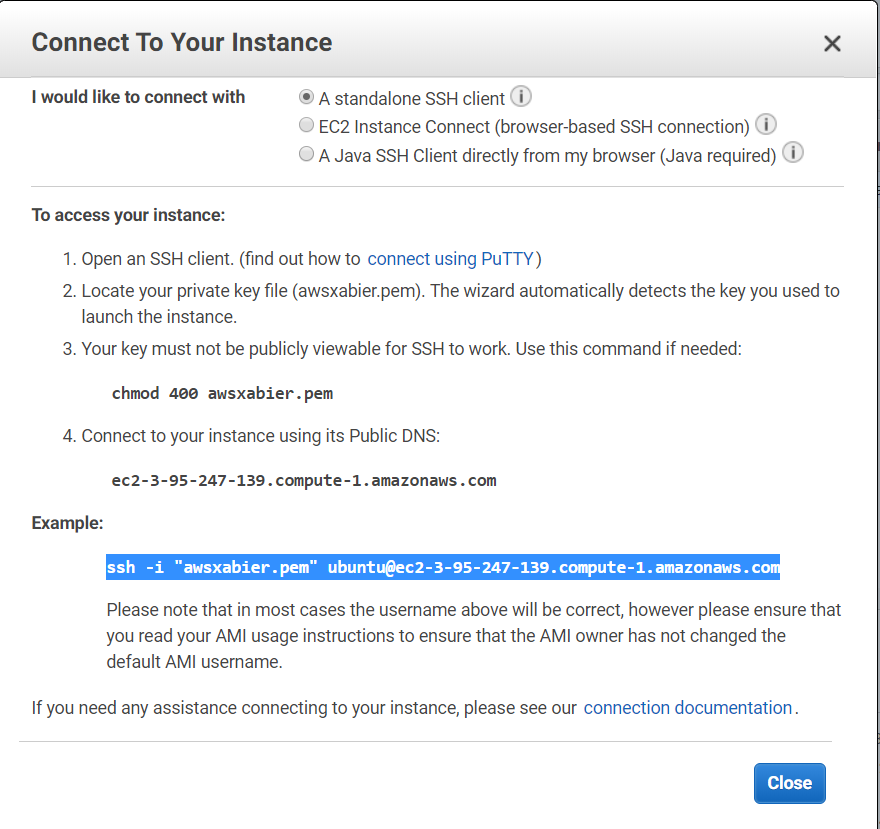

#### 2. Instalar Apache y habilitar las conexiones HTTP al servidor.

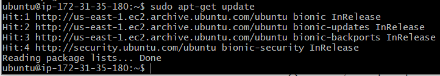

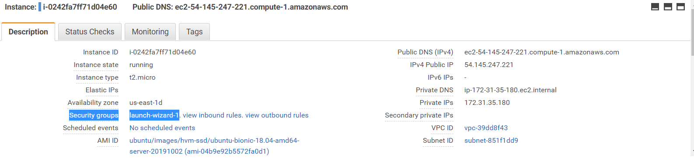
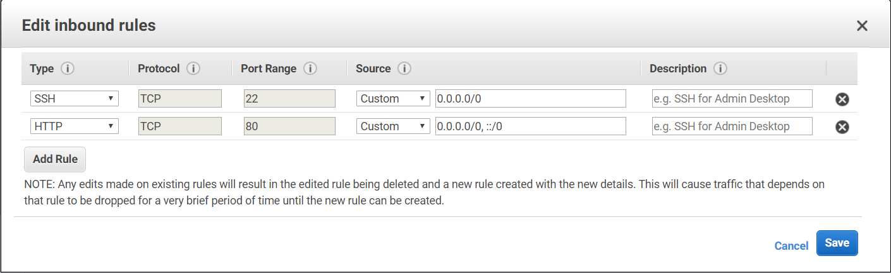
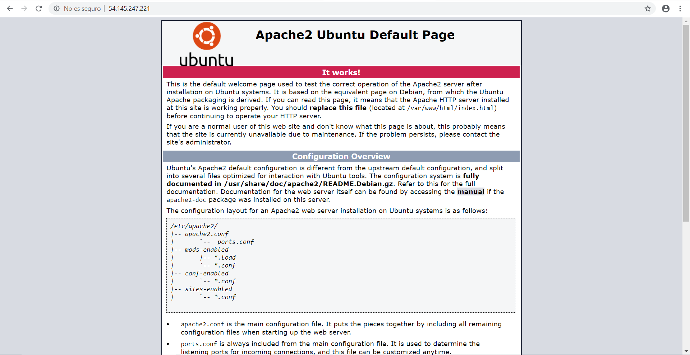

#### 3. Instalar MySQL y phpMyAdmin, crear un enlace simbólico a la carpeta phpMyAdmin en "/var/www/html/phpmyadmin" y crear un usuario en la base de datos con todos los permisos.

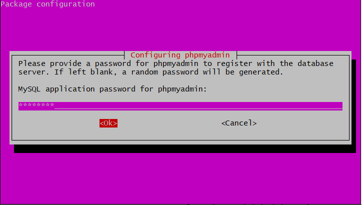
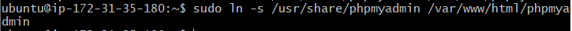
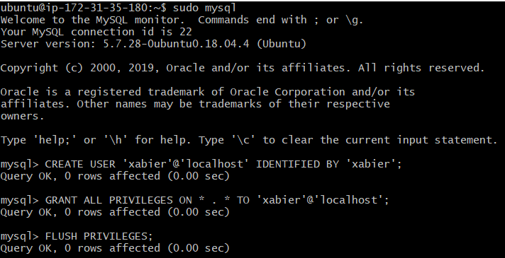
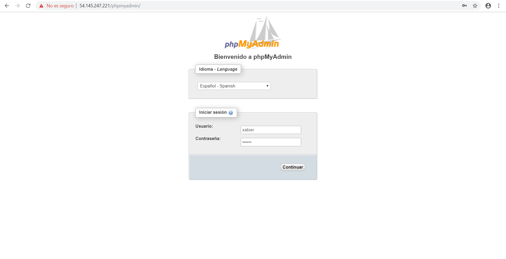
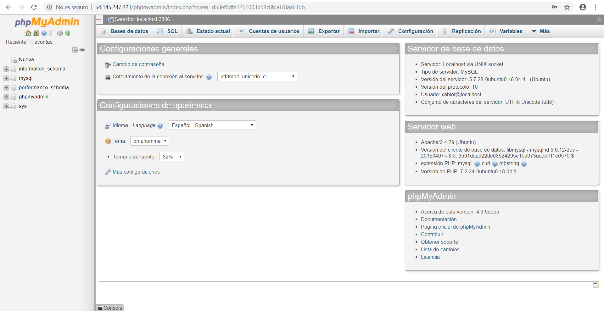

#### 4. Instalar PHP.

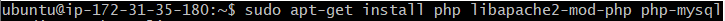
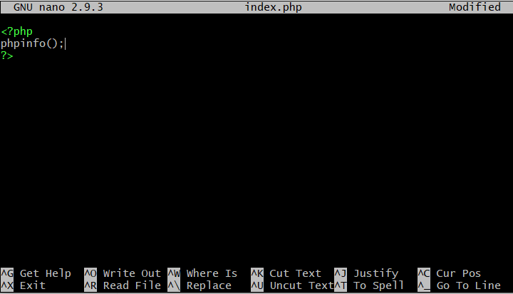
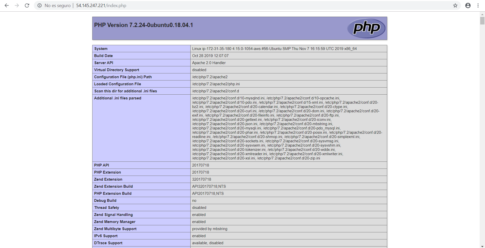