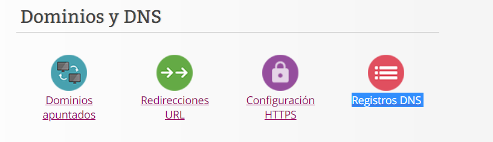
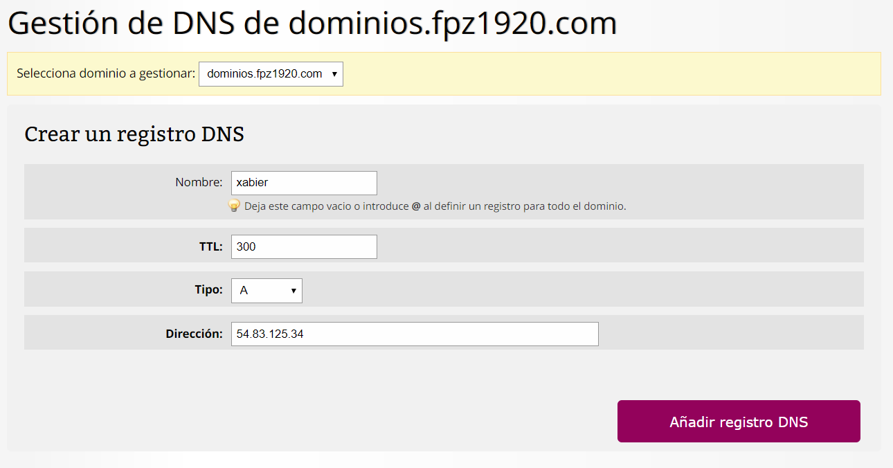
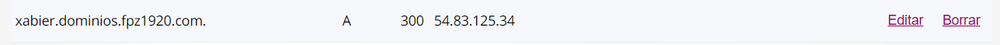
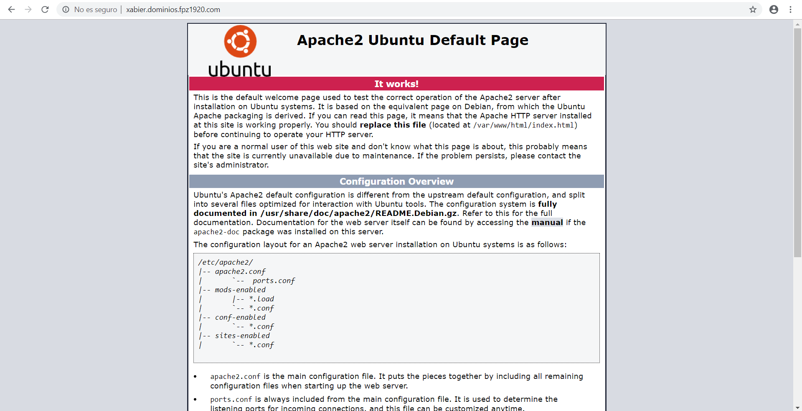

# TAREA 3: Gestión de DNS.

#### 1. Crear un registro DNS que asocie un nuevo subdominio con la IP elástica del servidor.

#### Tipos de registros DNS

+ A: Apunta a una dirección IP. (Ejemplo: `54.83.125.34`).
+ AAAA: Apunta a una dirección IP IPv6. (Ejemplo: `2001:0dd8:85a3:08d3:1319:8a2e:0370:7334`).
+ CNAME: Apunta a otro dominio o subdominio. (Ejemplo: `blog.example.com`).
+ TXT: Proporciona información de texto a fuentes externas a tu dominio.
+ SRV: Indica los servicios que ofrece tu dominio.