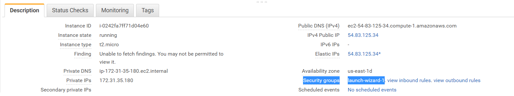
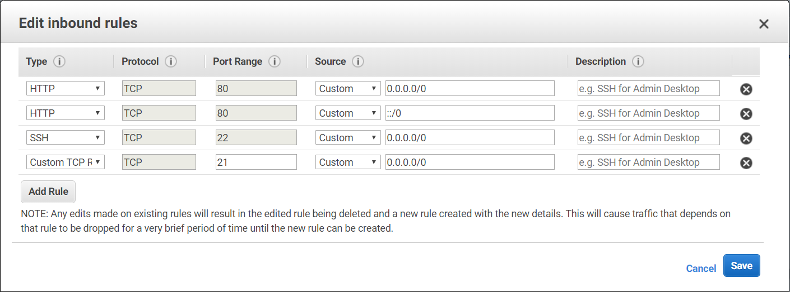
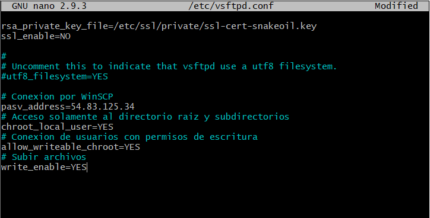
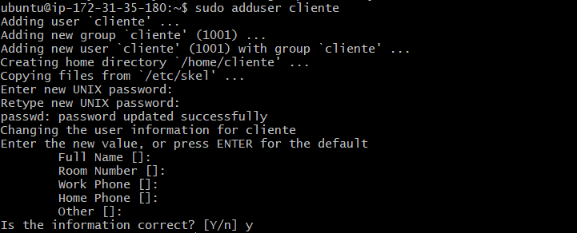
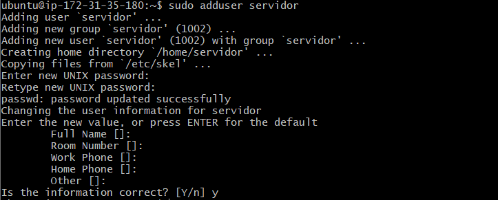
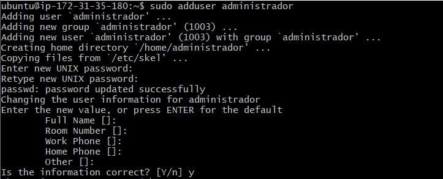
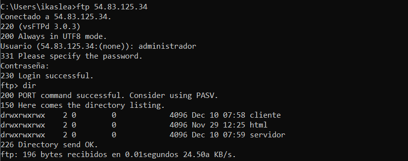
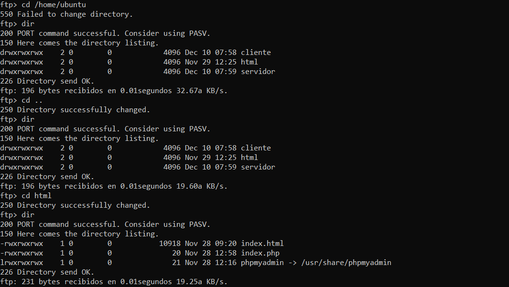
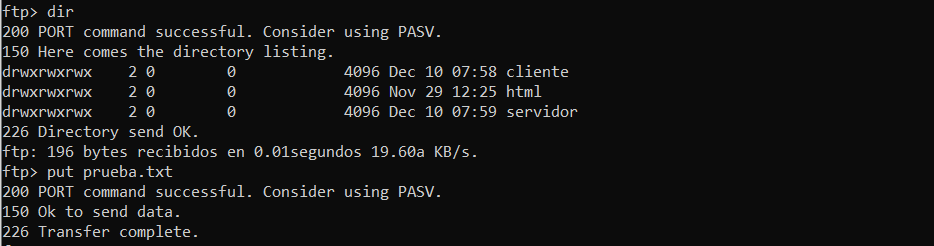

# TAREA 5: Servidor FTP.

#### 1. Habilitar las conexiones FTP al servidor.

#### 2. Instalar servidor FTP, modificar el archivo "vsftpd.conf" y reiniciar el servidor FTP.

#### 3. Crear los usuarios cliente, servidor y administrador y definir el directorio raiz de cada uno.

#### 4. Dar permisos a todos los usuarios en "/var/www".

