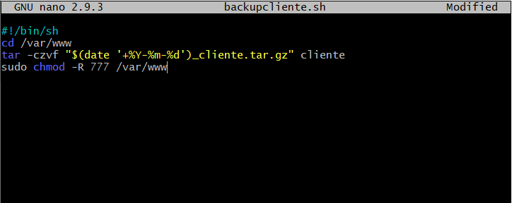
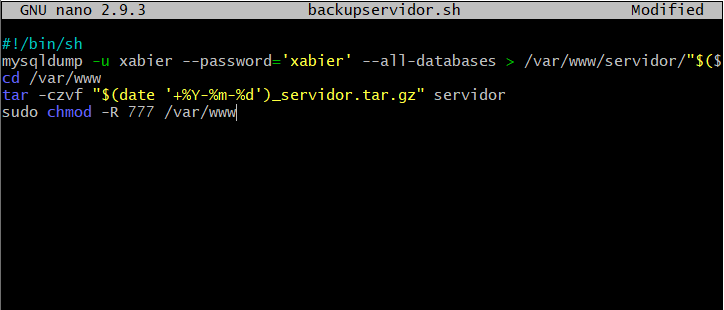
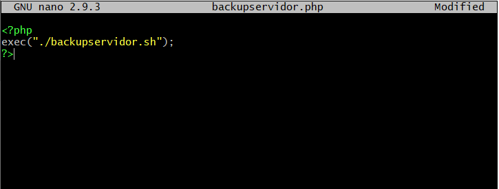
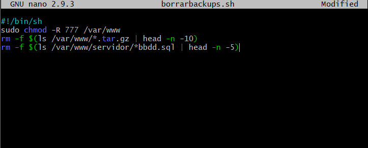
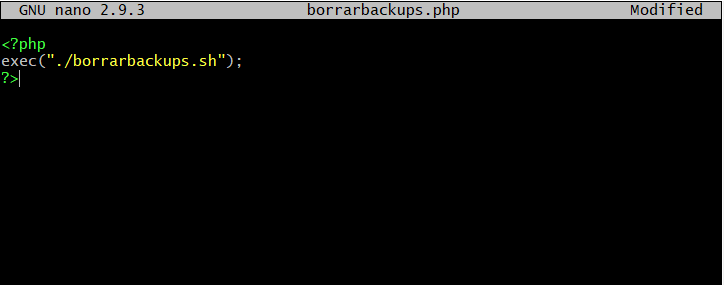
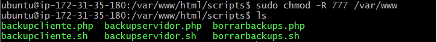
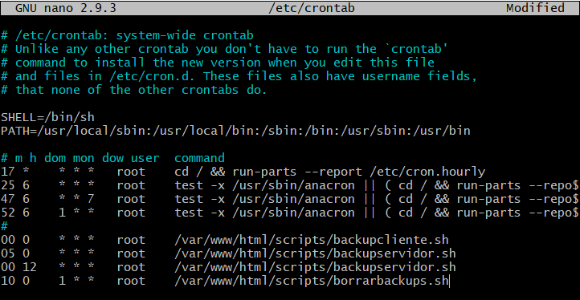
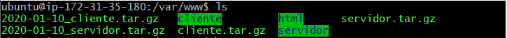

# TAREA 7: Automatizar copias de seguridad.

#### 1. Crear los scripts para crear las copias de seguridad de cliente y servidor, crear el script para borrar todas las copias de seguridad menos las de los ultimos 5 dias y dar permisos a todos los usuarios en "/var/www".

#### 2. Modificar el archivo "/etc/crontab" para automatizar la ejecución de los scripts.

